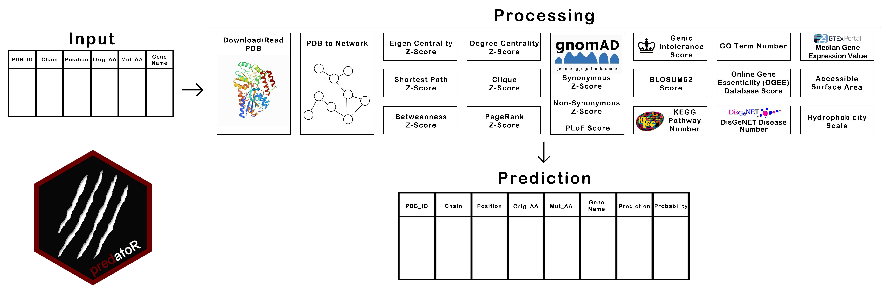

```{r, include = FALSE}
knitr::opts_chunk$set(
  collapse = TRUE,
  comment = "#>"
)
suppressPackageStartupMessages(library(predatoR))
```

# Quick Start

In this section, we show you how to use `predatoR` package for mutation impact prediction.

`predatoR` package makes prediction about amino acid mutations based on a pre-computed __Adaboost__ model (Accuracy: 0.9165, Sensitivity: 0.9537, Specificity: 0.8363, AUC: 0.9718) and classifies the mutation as __Disease Causing__ or __Silent__. Model created by using [Varibench](http://structure.bmc.lu.se/VariBench/) datasets. [Missense3D](http://missense3d.bc.ic.ac.uk/~missense3d/) datasets also used for additional model validation (Accuracy: 0.7869, Sensitivity: 0.7876, Specificity: 0.7862). 

`predatoR()` function is the wrapper function of the `predatoR` package. `predatoR()` gets a data.frame structure as an input. Input should contain 5 mandatory and 1 optional columns. Mandatory columns are  __'PDB_ID'__, __'Chain'__, __'Position'__, __'Orig_AA'__ and  __'Mut_AA'__. __'Gene_Name'__ column is optional. 
 
### Workflow



`predatoR()` function works on each PDB ID respectively. For each PDB ID;  

 - Downloads/Reads PDB file
 - Calculates distances between each atom
 - Creates network from PDB
 - Calculates Degree Centrality Z-Score of each atom
 - Calculates Eigen Centrality Z-Score of each atom
 - Calculates Shortest Path Z-Score of each atom
 - Calculates Betweenness Z-Score of each atom
 - Calculates Clique Z-Score of each atom
 - Calculates PageRank Z-Score of each atom
 - Gets gnomAD Synonymous Z-Score, Non-Synonymous Z-Score, and PLoF Score
 - Gets Genic Intolerance Score
 - Gets BLOSUM62 score of the mutation
 - Finds the number of KEGG Pathways which related with the input gene
 - Calculates the number of GO Terms related with the input gene
 - Calculates the number of diseases associated with the input gene
 - Gets Gene Essentiality Score
 - Makes prediction
 

If `predatoR()` couldn't find any information of any gene such as 'Genic Intolerance Score', these inputs will be removed from the query before the prediction step.
 
### Arguments
 
 `predatoR()` function has 4 arguments; 
 
 - __info_df:__ Input data.frame
 - __PDB_path:__ PDB file path if the user wants to use PDB structures stored locally (default = NULL)
 - __n_threads:__ Number of threads (default = NULL)
 - __gene_name_info:__ Whether there is gene name information in the input or not (default = TRUE)
 
 When running the `predatoR()` function, if gene name is included in the input, `gene_name_info`
 should be set as `TRUE`. If there is no gene name information in the input (`gene_name_info = FALSE`), 
 `predatoR()` function gets the related gene names from [Ensembl](https://www.ensembl.org/) and if there are multiple
 genes annotated for the PDB ID, asks user to choose input __'Gene_Name'__. 
 
 
 Example input with the __'Gene_Name'__ information included:
 
```{r example_gene_name, echo=FALSE}
test_data <- as.data.frame(rbind(c("3SQJ", "A", 3, "HIS", "GLN", "ALB"),
                                 c("3SQJ", "A", 60, "GLU", "LYS","ALB")))
colnames(test_data) <- c("PDB_ID", "Chain", "Position", "Orig_AA", "Mut_AA", "Gene_Name")
knitr::kable(test_data, align = c("c", "c", "c", "c", "c", "c"))
```
 
```{r example_gene_name_run, eval=FALSE}

library(predatoR)
prediction_result <- predatoR(test_data, gene_name_info = TRUE)

```

Example input with the __'Gene_Name'__ information does not included:
 
```{r example_no_gene_name, echo=FALSE}
test_data <- as.data.frame(rbind(c("3SQJ", "A", 3, "HIS", "GLN"),
                                 c("3SQJ", "A", 60, "GLU", "LYS")))
colnames(test_data) <- c("PDB_ID", "Chain", "Position", "Orig_AA", "Mut_AA")
knitr::kable(test_data, align = c("c", "c", "c", "c", "c"))
```
 
```{r example_no_gene_name_run, eval=FALSE}

prediction_result <- predatoR(test_data, gene_name_info = FALSE)

```

 
`predatoR()` function can work with partially added gene name informations. If some mutations has no gene name
information, it gets the related gene names from [Ensembl](https://www.ensembl.org/) and if there are multiple
 genes annotated for the PDB ID, gets the gene which has maximum GnomAD scores (`gene_name_info` should set as `TRUE`).
 
 
```{r example_partial_gene_name, echo=FALSE}
test_data <- as.data.frame(rbind(c("3SQJ", "A", 3, "HIS", "GLN", "ALB"),
                                 c("3SQJ", "A", 60, "GLU", "LYS","ALB"),
                                 c("1A4Y", "A", 169, "PRO", "LEU", "")))
colnames(test_data) <- c("PDB_ID", "Chain", "Position", "Orig_AA", "Mut_AA", "Gene_Name")
knitr::kable(test_data, align = c("c", "c", "c", "c", "c", "c"))
```
 
```{r example_partial_gene_name_run, eval=FALSE}

prediction_result <- predatoR(test_data, gene_name_info = TRUE)

```
 
 
`predatoR()` function uses `max_thread_number - 1` as a default when `n_threads = NULL`. `n_threads` can be set
by user.
 

```{r example_thread_number, eval=FALSE}

prediction_result <- predatoR(test_data, n_threads = 8) # 8 threads will be used

```


`predatoR()` function downloads each PDB by default (`PDB_path = NULL`) or can use PDB files stored 
locally when `PDB_path` specified. It will automatically read and process the input PDB file from the 
path.
 

```{r example_path, eval=FALSE}

prediction_result <- predatoR(test_data, PDB_path = "path/to/PDB/files/") 

```


### Result

`predatoR()` function returns a data.frame which contains additional two columns; __'Prediction'__ and __'Probability'__. __'Prediction'__ represents the result of the impact prediction and __'Probability'__ represents the probability that the mutation classified as __Disease Causing__ or __Silent__. 

```{r example_output, echo=FALSE}
example_result <- as.data.frame(rbind(c("3SQJ", "A", 3, "HIS", "GLN", "ALB", "Silent", "0.7353718"),
                                      c("3SQJ", "A", 60, "GLU", "LYS","ALB", "Silent", "0.7919581")))

colnames(example_result) <- c("PDB_ID", "Chain", "Position", "Orig_AA", "Mut_AA", "Gene_Name", "Prediction", "Probability")

knitr::kable(example_result, align = c("c", "c", "c", "c", "c", "c", "c", "c"))
```


## Utility Functions

The wrapper function `predatoR()` uses the utility functions below;

 - `read_PDB()`
 - `PDB2connections()`
 - `degree_score()`
 - `eigen_centrality_score()`
 - `shorteset_path_score()`
 - `betweenness_score()`
 - `clique_score()`
 - `pagerank_score()`
 - `gnomad_scores()`
 - `BLOSUM62_score()`
 - `KEGG_pathway_number()`
 - `genic_intolerance()`
 - `GO_terms()`
 - `DisGeNET()`
 - `gene_essentiality()`
 - `impact_prediction()`
 

### `read_PDB`

`read_PDB()` function downloads input PDB by default but can read and process locally stored PDB structures.
After reading, create a matrix that contains only ATOM labelled structures.

#### Arguments

`read_PDB()` has 2 arguments;

 - __PDB_ID:__ PDB ID (E.g. "3SQJ")
 - __PDB_path:__ PDB file path if files stored locally (default = FALSE)

#### Usage 

```{r read_pdb_example, eval=FALSE}

# if file stored locally
PDB_2DN2_structure <- read_PDB("3SQJ", PDB_path = "path/to/PDB/files/") 

# if file is going to be downloded
PDB_2DN2_structure <- read_PDB("3SQJ") 

```


### `PDB2connections`

`PDB2connections()` function calculates distances between every ATOM in the PDB structure 
and creates an edge between atoms if the distance <= 7 Angstrom. As a result, returns a data frame 
which contains connection list.

#### Arguments

`PDB2connections()` has 4 arguments;

 - __atom_matrix:__ Matrix created by `read_PDB()` function
 - __filtered_info_df:__ data.frame contains only one PDB entries
 - __n_threads:__ number of threads (default = NULL)
 - __single_run:__ should be set as TRUE when using `PDB2connections()` function alone (default = TRUE)

#### Usage 

```{r PDB2connections_example, eval=FALSE}

test_data <- as.data.frame(rbind(c("3SQJ", "A", 3, "HIS", "GLN", "ALB"),
                                 c("3SQJ", "A", 60, "GLU", "LYS","ALB")))

colnames(test_data) <- c("PDB_ID", "Chain", "Position", "Orig_AA", "Mut_AA", "Gene_Name")

edge_list <- PDB2connections(atom_matrix = PDB_2DN2_structure, filtered_info_df = test_data, n_threads = 8, single_run = TRUE) 

```


### `degree_score`

`degree_score()` function calculates the total number of connections of all nodes.
Calculates Z-scores of each node and returns scores of desired nodes.

#### Arguments

`degree_score()` has 2 arguments;

 - __edge_list:__ List created by `PDB2connections()` function
 - __filtered_info_df:__ data.frame contains only one PDB entries

#### Usage 

```{r degree_score_example, eval=FALSE}

test_data <- as.data.frame(rbind(c("3SQJ", "A", 3, "HIS", "GLN", "ALB"),
                                 c("3SQJ", "A", 60, "GLU", "LYS","ALB")))

colnames(test_data) <- c("PDB_ID", "Chain", "Position", "Orig_AA", "Mut_AA", "Gene_Name")

degree_z_score <- degree_score(edge_list = edge_list, filtered_info_df = test_data) 

```


### `eigen_centrality_score`

`eigen_centrality_score()` function calculates the total number of connections of nodes to which a node is connected.
Calculates Z-scores of all nodes and returns scores of desired nodes.

#### Arguments

`eigen_centrality_score()` has 2 arguments;

 - __edge_list:__ List created by `PDB2connections()` function
 - __filtered_info_df:__ data.frame contains only one PDB entries

#### Usage 

```{r eigen_centrality_score_example, eval=FALSE}

test_data <- as.data.frame(rbind(c("3SQJ", "A", 3, "HIS", "GLN", "ALB"),
                                 c("3SQJ", "A", 60, "GLU", "LYS","ALB")))

colnames(test_data) <- c("PDB_ID", "Chain", "Position", "Orig_AA", "Mut_AA", "Gene_Name")

eigen_centrality_z_score <- eigen_centrality_score(edge_list = edge_list, filtered_info_df = test_data) 

```


### `shorteset_path_score`

`shorteset_path_score()` function calculates the distances between each node via `shortest.paths()` function
of igraph package, sum distances of each nodes, calculates Z-scores and returns scores of desired nodes.

#### Arguments

`shorteset_path_score()` has 2 arguments;

 - __edge_list:__ List created by `PDB2connections()` function
 - __filtered_info_df:__ data.frame contains only one PDB entries

#### Usage 

```{r shorteset_path_score_example, eval=FALSE}

test_data <- as.data.frame(rbind(c("3SQJ", "A", 3, "HIS", "GLN", "ALB"),
                                 c("3SQJ", "A", 60, "GLU", "LYS","ALB")))

colnames(test_data) <- c("PDB_ID", "Chain", "Position", "Orig_AA", "Mut_AA", "Gene_Name")

shorteset_path_z_score <- shorteset_path_score(edge_list = edge_list, filtered_info_df = test_data) 

```


### `betweenness_score`

`betweenness_score()` function calculates Betweenness Score of each node by using `betweenness()` 
function of igraph package, turns the scores into Z-scores and returns scores of desired nodes.

`betweenness()` function calculates Betweenness by using formula below;


$$
\sum_{i \neq j, i \neq v,j \neq v}{g_{ivj}/g_{ij}}
$$

#### Arguments

`betweenness_score()` has 2 arguments;

 - __edge_list:__ List created by `PDB2connections()` function
 - __filtered_info_df:__ data.frame contains only one PDB entries

#### Usage 

```{r betweenness_score_example, eval=FALSE}

test_data <- as.data.frame(rbind(c("3SQJ", "A", 3, "HIS", "GLN", "ALB"),
                                 c("3SQJ", "A", 60, "GLU", "LYS","ALB")))

colnames(test_data) <- c("PDB_ID", "Chain", "Position", "Orig_AA", "Mut_AA", "Gene_Name")

betweenness_z_score <- betweenness_score(edge_list = edge_list, filtered_info_df = test_data) 

```


### `clique_score`

`clique_score()` function calculates how many of the nodes that a node is connected to are connected to each other.
Turns the scores into Z-scores and returns scores of desired nodes.

#### Arguments

`clique_score()` has 4 arguments;

 - __edge_list:__ List created by `PDB2connections()` function
 - __filtered_info_df:__ data.frame contains only one PDB entries
 - __n_threads:__ number of threads (default = NULL)
 - __single_run:__ should be set as TRUE when using `clique_score()` function alone (default = TRUE)

#### Usage 

```{r clique_score_example, eval=FALSE}

test_data <- as.data.frame(rbind(c("3SQJ", "A", 3, "HIS", "GLN", "ALB"),
                                 c("3SQJ", "A", 60, "GLU", "LYS","ALB")))

colnames(test_data) <- c("PDB_ID", "Chain", "Position", "Orig_AA", "Mut_AA", "Gene_Name")

clique_z_score <- clique_score(edge_list = edge_list, filtered_info_df = test_data, n_threads = 8, single_run = TRUE) 

```


### `pagerank_score`

`pagerank_score()` function assigns an importance score to every node via
`page_rank()` function of igraph package. Turns the scores into Z-scores and returns scores of desired nodes.

#### Arguments

`pagerank_score()` has 2 arguments;

 - __edge_list:__ List created by `PDB2connections()` function
 - __filtered_info_df:__ data.frame contains only one PDB entries

#### Usage 

```{r pagerank_score_example, eval=FALSE}

test_data <- as.data.frame(rbind(c("3SQJ", "A", 3, "HIS", "GLN", "ALB"),
                                 c("3SQJ", "A", 60, "GLU", "LYS","ALB")))

colnames(test_data) <- c("PDB_ID", "Chain", "Position", "Orig_AA", "Mut_AA", "Gene_Name")

pagerank_z_score <- pagerank_score(edge_list = edge_list, filtered_info_df = test_data) 

```


### `gnomad_scores`

`gnomad_scores()` function gets input gene's gnomAD Synonymous Z-Score, Non-Synonymous Z-Score, and PLoF Score
from data retrieved from [gnomAD](https://gnomad.broadinstitute.org/). If there is no gene name information in the input,
`gnomad_scores()` finds the genes that related with input PDB ID by using a dataset retrieved from [Ensembl](https://www.ensembl.org/). 
If there are multiple genes annotated for same PDB, `gnomad_scores()` function gets the gene that has maximum Synonymous Z-Score, Non-Synonymous Z-Score, and PLoF Score.

#### Arguments

`gnomad_scores()` has 1 arguments;

 - __filtered_info_df:__ data.frame contains only one PDB entries

#### Usage 

```{r gnomad_example, eval=FALSE}

test_data <- as.data.frame(rbind(c("3SQJ", "A", 3, "HIS", "GLN", "ALB"),
                                 c("3SQJ", "A", 60, "GLU", "LYS","ALB")))

colnames(test_data) <- c("PDB_ID", "Chain", "Position", "Orig_AA", "Mut_AA", "Gene_Name")

gnomad_score <- gnomad_scores(filtered_info_df = test_data) 

```


### `BLOSUM62_score`

`BLOSUM62_score()` function returns BLOSUM62 scores of input mutations.

#### Arguments

`BLOSUM62_score()` has 1 arguments;

 - __info_df:__ data.frame contains all the input mutations

#### Usage 

```{r BLOSUM62_score_example, eval=FALSE}

test_data <- as.data.frame(rbind(c("3SQJ", "A", 3, "HIS", "GLN", "ALB"),
                                 c("3SQJ", "A", 60, "GLU", "LYS","ALB")))

colnames(test_data) <- c("PDB_ID", "Chain", "Position", "Orig_AA", "Mut_AA", "Gene_Name")

BLOSUM62_scores <- BLOSUM62_score(info_df = test_data) 

```


### `KEGG_pathway_number`

`KEGG_pathway_number()` function finds the number of KEGG Pathways which related with the input genes.

#### Arguments

`KEGG_pathway_number()` has 1 arguments;

 - __filtered_info_df:__ input data.frame contains only one PDB entries

#### Usage 

```{r KEGG_pathway_number_example, eval=FALSE}

test_data <- as.data.frame(rbind(c("3SQJ", "A", 3, "HIS", "GLN", "ALB"),
                                 c("3SQJ", "A", 60, "GLU", "LYS","ALB")))

colnames(test_data) <- c("PDB_ID", "Chain", "Position", "Orig_AA", "Mut_AA", "Gene_Name")

KEGG_path_number <- KEGG_pathway_number(filtered_info_df = test_data) 

```


### `genic_intolerance`

`genic_intolerance()` function returns Genic Intolerance score by using a dataset retrieved from 
[Genic Intolerance](http://genic-intolerance.org/).

#### Arguments

`genic_intolerance()` has 1 arguments;

 - __filtered_info_df:__ input data.frame contains only one PDB entries

#### Usage 

```{r genic_intolerance_example, eval=FALSE}

test_data <- as.data.frame(rbind(c("3SQJ", "A", 3, "HIS", "GLN", "ALB"),
                                 c("3SQJ", "A", 60, "GLU", "LYS","ALB")))

colnames(test_data) <- c("PDB_ID", "Chain", "Position", "Orig_AA", "Mut_AA", "Gene_Name")

genic_intolerance_score <- genic_intolerance(filtered_info_df = test_data) 


```


### `GO_terms`

`GO_terms()` function returns the number of GO terms related with the input genes.

#### Arguments

`GO_terms()` has 1 arguments;

 - __filtered_info_df:__ input data.frame contains only one PDB entries

#### Usage 

```{r GO_terms_example, eval=FALSE}

test_data <- as.data.frame(rbind(c("3SQJ", "A", 3, "HIS", "GLN", "ALB"),
                                 c("3SQJ", "A", 60, "GLU", "LYS","ALB")))

colnames(test_data) <- c("PDB_ID", "Chain", "Position", "Orig_AA", "Mut_AA", "Gene_Name")

GO_terms_score <- GO_terms(filtered_info_df = test_data) 


```


### `DisGeNET`

`DisGeNET()` function returns number of diseases related with input genes by using a dataset retrieved from 
[DisGeNET](http://https://www.disgenet.org/).

#### Arguments

`DisGeNET()` has 1 arguments;

 - __filtered_info_df:__ input data.frame contains only one PDB entries

#### Usage 

```{r DisGeNET_example, eval=FALSE}

test_data <- as.data.frame(rbind(c("3SQJ", "A", 3, "HIS", "GLN", "ALB"),
                                 c("3SQJ", "A", 60, "GLU", "LYS","ALB")))

colnames(test_data) <- c("PDB_ID", "Chain", "Position", "Orig_AA", "Mut_AA", "Gene_Name")

DisGeNET_score <- DisGeNET(filtered_info_df = test_data) 


```


### `gene_essentiality`

`gene_essentiality()` function returns Gene Essentiality scores of the input genes by using a dataset retrieved from 
[Online Gene Essentiality (OGEE) Database](https://v3.ogee.info/#/home).

#### Arguments

`gene_essentiality()` has 1 arguments;

 - __filtered_info_df:__ input data.frame contains only one PDB entries

#### Usage 

```{r gene_essentiality_example, eval=FALSE}

test_data <- as.data.frame(rbind(c("3SQJ", "A", 3, "HIS", "GLN", "ALB"),
                                 c("3SQJ", "A", 60, "GLU", "LYS","ALB")))

colnames(test_data) <- c("PDB_ID", "Chain", "Position", "Orig_AA", "Mut_AA", "Gene_Name")

gene_essentiality_score <- gene_essentiality(filtered_info_df = test_data) 


```


### `impact_prediction`

`impact_prediction()` function makes prediction based on a pre-computed __Adaboost__ model and classifies the mutation as __Disease Causing__ or __Silent__.

#### Arguments

`impact_prediction()` has 1 arguments;

 - __final_df:__ data.frame contains all the required information for impact prediction

#### Usage 

As an input data.frame containing __PDB_ID__, __Chain__, __Position__, __Orig_AA__, __Mut_AA__, __Gene_Name__, __eigen_z_score__, __shortest_path_z__, __betwenness_scores_z__, __syn_z__, __mis_z__, __pLI__, __blosum62_scores__, __kegg_pathway_number__ and __genic_intolerance__ scores, `impact_prediction()` classifies the mutation as __Disease Causing__ or __Silent__.


Example input looks like:

```{r impact_prediction_example_input, echo=FALSE}

final_df <- as.data.frame(rbind(c("3SQJ", "A", 3, "HIS", "GLN", "ALB", -1.53050220615806, 
                                  -0.507499112395318, 1.13856030731978, -0.537583566239163, -1.40256053843562, -1.55402381567269, 
                                  -0.91513, 0.65574, 0.64329, 0, 12, -0.89, 
                                  4, 81, 1),
                                c("3SQJ", "A", 60, "GLU", "LYS", "ALB", -1.32210500629763, 
                                  -0.508688123731673, 1.75397316724014, -0.542439760676518, -1.25314372919749, -1.16009102167216, 
                                  -0.91513, 0.65574, 0.64329, 1, 12, -0.89, 
                                  4, 81, 1)))

colnames(final_df) <- c("PDB_ID", "Chain", "Position", "Orig_AA", "Mut_AA", "Gene_Name", "degree_z_score",
                        "eigen_z_score", "shortest_path_z", "betweenness_scores_z", "clique_z_score", "pagerank_z_score",
                        "syn_z", "mis_z", "pLI", "blosum62_scores", "kegg_pathway_number", "genic_intolerance",
                        "go_terms", "disgenet", "gene_essentiality")

DT::datatable(final_df,options = list(scrollX = TRUE))

```


```{r impact_prediction_example, eval=FALSE}

prediction_result <- impact_prediction(final_df) 

```

```{r impact_prediction_example_output, echo=FALSE}

example_result <- as.data.frame(rbind(c("3SQJ", "A", 3, "HIS", "GLN", "ALB", "Silent", "0.7353718"),
                                      c("3SQJ", "A", 60, "GLU", "LYS","ALB", "Silent", "0.7919581")))

colnames(example_result) <- c("PDB_ID", "Chain", "Position", "Orig_AA", "Mut_AA", "Gene_Name", "Prediction", "Probability")

knitr::kable(example_result, align = c("c", "c", "c", "c", "c", "c", "c", "c"))
```


<br />
<br />
