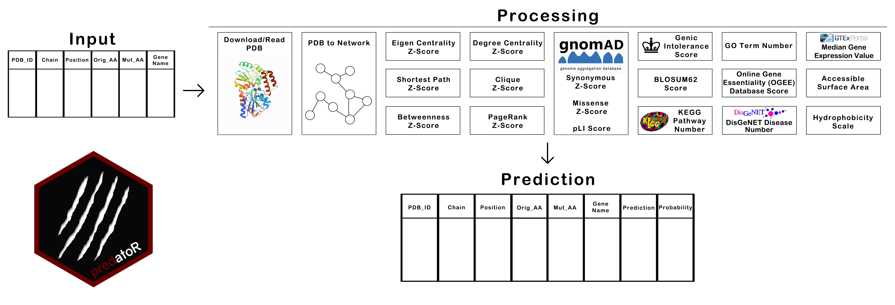

```{r, include = FALSE}
knitr::opts_chunk$set(
  collapse = TRUE,
  comment = "#>"
)
suppressPackageStartupMessages(library(predatoR))
```

# Quick Start

In this section, we show you how to use `predatoR` package for impact prediction.

`predatoR()` function is the wrapper function of the `predatoR` package. `predatoR()` 
gets a data.frame structure as an input. Input should contain 5 mandatory and 1 optional columns.
 Mandatory columns are  __'PDB_ID'__, __'Chain'__, __'Position'__, __'Orig_AA'__ and  __'Mut_AA'__.
 __'Gene_Name'__ column is optional. 
 
### Workflow



`predatoR()` function works on each PDB ID respectively. For each PDB ID;  

 - Download/Read PDB file
 - Calculate distances between every atom
 - Create network from PDB
 - Calculate Eigen Centrality Z-Score of each Carbon-α atom
 - Calculate Shortest Path Z-Score of each Carbon-α atom
 - Calculate Betweenness Z-Score of each Carbon-α atom
 - Gets GnomAD Synonymous Z-Score, Non-Synonymous Z-Score, and PLoF Score
 - Gets Genic Intolerance Score
 - Gets BLOSUM62 score of the mutation
 - Finds the number of KEGG Pathways which contains the input gene
 - Make prediction
 
If there are missing information such as no Genic Intolerance Score, these inputs will be removed from the query.
 
 
### Arguments
 
 `predatoR()` function has 4 arguments; 
 
 - info_df: Input data.frame
 - PDB_path: PDB file path if the user wants to use PDB structures stored locally (default = NULL)
 - n_threads: number of threads (default = NULL)
 - gene_name_info: whether there is gene name information in the input or not (default = TRUE)
 
 When running the `predatoR()` function, if gene name is included in the input, `gene_name_info`
 should be set as `TRUE`. If there is no gene name information in the input (`gene_name_info = FALSE`), 
 `predatoR()` function gets the related gene names from __'Ensembl'__ and if there are multiple
 genes annotated for the PDB ID, asks user to choose input __'Gene_Name'__. 
 
 
 Example input with __'Gene_Name'__ information included:
 
```{r example_gene_name, echo=FALSE}
test_data <- as.data.frame(rbind(c("2DN2", "B", 1, "VAL", "ALA", "HBB"),
                                 c("2DN2", "B", 6, "GLU", "ALA", "HBB")))
colnames(test_data) <- c("PDB_ID", "Chain", "Position", "Orig_AA", "Mut_AA", "Gene_Name")
knitr::kable(test_data, align = c("c", "c", "c", "c", "c", "c"))
```
 
```{r example_gene_name_run, eval=FALSE}

library(predatoR)
prediction_result <- predatoR(test_data, gene_name_info = TRUE)

```

Example input with __'Gene_Name'__ information does not included:
 
```{r example_no_gene_name, echo=FALSE}
test_data <- as.data.frame(rbind(c("2DN2", "B", 1, "VAL", "ALA"),
                                 c("2DN2", "B", 6, "GLU", "ALA")))
colnames(test_data) <- c("PDB_ID", "Chain", "Position", "Orig_AA", "Mut_AA")
knitr::kable(test_data, align = c("c", "c", "c", "c", "c"))
```
 
```{r example_no_gene_name_run, eval=FALSE}

prediction_result <- predatoR(test_data, gene_name_info = FALSE)

```

 
`predatoR()` function can work with partially added gene name informations. If some mutations has no gene name
information, it ets the related gene names from __'Ensembl-BioMart'__ and if there are multiple
 genes annotated for the PDB ID, asks user to choose input __'Gene_Name'__ (`gene_name_info` should set as `TRUE`).
 
 
```{r example_partial_gene_name, echo=FALSE}
test_data <- as.data.frame(rbind(c("2DN2", "B", 1, "VAL", "ALA", "HBB"),
                                 c("2DN2", "B", 6, "GLU", "ALA", "HBB"),
                                 c("4ONL", "A", 36, "GLU", "GLY", "")))
colnames(test_data) <- c("PDB_ID", "Chain", "Position", "Orig_AA", "Mut_AA", "Gene_Name")
knitr::kable(test_data, align = c("c", "c", "c", "c", "c", "c"))
```
 
```{r example_partial_gene_name_run, eval=FALSE}

prediction_result <- predatoR(test_data, gene_name_info = TRUE)

```
 
 
`predatoR()` function uses `max_thread_number - 1` as a default when `n_threads = NULL`. `n_threads` can be set
by user.
 

```{r example_thread_number, eval=FALSE}

prediction_result <- predatoR(test_data, n_threads = 8) # 8 threads will be used

```


`predatoR()` function downloads each PDB by default (`PDB_path = NULL`) or can use PDB files stored 
locally when `PDB_path` specified. It will automatically read and process the input PDB file from the 
path.
 

```{r example_path, eval=FALSE}

prediction_result <- predatoR(test_data, PDB_path = "path/to/PDB/files/") 

```


### Result

`predatoR()` function returns a data.frame which contains additional two columns; __'Prediction'__ and __'Probability'__. __'Prediction'__ represents the result of the impact prediction and __'Probability'__ represents the probability that the mutation classified as __Disease Causing__ or __Silent__. 

```{r example_output, echo=FALSE}
example_result <- as.data.frame(rbind(c("2DN2", "B", 1, "VAL", "ALA", "HBB", "Silent", "0.6205009"),
                                      c("2DN2", "B", 6, "GLU", "ALA", "HBB", "Silent", "0.6286857")))

colnames(example_result) <- c("PDB_ID", "Chain", "Position", "Orig_AA", "Mut_AA", "Gene_Name", "Prediction", "Probability")

knitr::kable(example_result, align = c("c", "c", "c", "c", "c", "c", "c", "c"))
```


## Utility Functions

The wrapper function `predatoR()` uses the utility functions below;

 - `read_PDB()`
 - `PDB2connections()`
 - `eigen_centrality_score()`
 - `shorteset_path_score()`
 - `betweenness_score()`
 - `gnomad_scores()`
 - `BLOSUM62_score()`
 - `KEGG_pathway_number()`
 - `genic_intolerance()`
 - `impact_prediction()`
 

### `read_PDB()`

`read_PDB()` function downloads input PDB by default but can read and process locally stored PDB structures.
After reading, create a matrix that contains only ATOM labelled structures.

#### Arguments

`read_PDB()` has 2 arguments;

 - __PDB_ID:__ PDB ID (E.g. "2DN2")
 - __PDB_path:__ PDB file path if files stored locally (default = FALSE)

#### Usage 

```{r read_pdb_example, eval=FALSE}

# if file stored locally
PDB_2DN2_structure <- read_PDB("2DN2", PDB_path = "path/to/PDB/files/") 

# if file is going to be downloded
PDB_2DN2_structure <- read_PDB("2DN2") 

```


### `PDB2connections()`

`PDB2connections()` function calculate distances between every ATOM in the PDB structure 
and create an edge between atoms if the distance >= 7 Angstrom. As a result, returns a data frame 
which contains connection list.

#### Arguments

`PDB2connections()` has 2 arguments;

 - __atom_matrix:__ Matrix created by `read_PDB()` function
 - __filtered_info_df:__ data.frame which contain only one PDB entries

#### Usage 

```{r PDB2connections_example, eval=FALSE}

test_data <- as.data.frame(rbind(c("2DN2", "B", 1, "VAL", "ALA", "HBB"),
                                 c("2DN2", "B", 6, "GLU", "ALA", "HBB")))

colnames(test_data) <- c("PDB_ID", "Chain", "Position", "Orig_AA", "Mut_AA", "Gene_Name")

edge_list <- PDB2connections(atom_matrix = PDB_2DN2_structure, filtered_info_df = test_data) 

```


### `eigen_centrality_score()`

`eigen_centrality_score()` function calculates the total number of connections of nodes to which a node is connected.
Calculate Z-scores of each node and returns desired nodes scores.

#### Arguments

`eigen_centrality_score()` has 2 arguments;

 - __connections_df:__ Matrix created by `PDB2connections()` function
 - __filtered_info_df:__ data.frame which contain only one PDB entries

#### Usage 

```{r eigen_centrality_score_example, eval=FALSE}

test_data <- as.data.frame(rbind(c("2DN2", "B", 1, "VAL", "ALA", "HBB"),
                                 c("2DN2", "B", 6, "GLU", "ALA", "HBB")))

colnames(test_data) <- c("PDB_ID", "Chain", "Position", "Orig_AA", "Mut_AA", "Gene_Name")

eigen_centrality_z_score <- eigen_centrality_score(edge_list = PDB_2DN2_structure, filtered_info_df = test_data) 

```


### `shorteset_path_score()`

`shorteset_path_score()` function calculates the distances between each node via \code{shortest.paths} function
of igraph package, sum distances of each nodes, calculates Z-score and returns desired nodes scores.

#### Arguments

`shorteset_path_score()` has 2 arguments;

 - __connections_df:__ Matrix created by `PDB2connections()` function
 - __filtered_info_df:__ data.frame which contain only one PDB entries

#### Usage 

```{r shorteset_path_score_example, eval=FALSE}

test_data <- as.data.frame(rbind(c("2DN2", "B", 1, "VAL", "ALA", "HBB"),
                                 c("2DN2", "B", 6, "GLU", "ALA", "HBB")))

colnames(test_data) <- c("PDB_ID", "Chain", "Position", "Orig_AA", "Mut_AA", "Gene_Name")

eigen_centrality_z_score <- shorteset_path_score(edge_list = PDB_2DN2_structure, filtered_info_df = test_data) 

```


### `betweenness_score()`

`betweenness_score()` function calculates Betweenness Score of each node by using \code{betweenness} 
function of igraph package, turn the scores into Z-scores and returns desired nodes scores.

\code{betweenness} function calculates Betweenness by using formula below;


$$
\sum_{i \neq j, i \neq v,j \neq v}{g_{ivj}/g_{ij}}
$$

#### Arguments

`betweenness_score()` has 2 arguments;

 - __connections_df:__ Matrix created by `PDB2connections()` function
 - __filtered_info_df:__ data.frame which contain only one PDB entries

#### Usage 

```{r betweenness_score_example, eval=FALSE}

test_data <- as.data.frame(rbind(c("2DN2", "B", 1, "VAL", "ALA", "HBB"),
                                 c("2DN2", "B", 6, "GLU", "ALA", "HBB")))

colnames(test_data) <- c("PDB_ID", "Chain", "Position", "Orig_AA", "Mut_AA", "Gene_Name")

betweenness_z_score <- betweenness_score(edge_list = PDB_2DN2_structure, filtered_info_df = test_data) 

```


### `gnomad_scores()`

`gnomad_scores()` function gets input gene's GnomAD Synonymous Z-Score, Non-Synonymous Z-Score, and PLoF Score
from data retrieved from [gnomAD](https://gnomad.broadinstitute.org/). If there is no gene name information in the input,
`gnomad_scores()` finds the genes that related with input PDB ID by using a dataset retrieved from [Ensembl](https://www.ensembl.org/). 
`gnomad_scores()` returns a list contains two elements; first one is the gnomAD scores added input data.frame and a 
gene name for working with no gene name input. 

#### Arguments

`gnomad_scores()` has 2 arguments;

 - __PDB_ID:__ PDB ID (E.g. "2DN2")
 - __filtered_info_df:__ data.frame which contain only one PDB entries

#### Usage 

```{r gnomad_example, eval=FALSE}

test_data <- as.data.frame(rbind(c("2DN2", "B", 1, "VAL", "ALA", "HBB"),
                                 c("2DN2", "B", 6, "GLU", "ALA", "HBB")))

colnames(test_data) <- c("PDB_ID", "Chain", "Position", "Orig_AA", "Mut_AA", "Gene_Name")

gnomad_score <- gnomad_scores(PDB_ID = "2DN2", filtered_info_df = test_data) 

```


### `BLOSUM62_score()`

`BLOSUM62_score()` function returns BLOSUM62 scores of input mutations.

#### Arguments

`BLOSUM62_score()` has 1 arguments;

 - __info_df:__ data.frame contains all the input mutations

#### Usage 

```{r BLOSUM62_score_example, eval=FALSE}

test_data <- as.data.frame(rbind(c("2DN2", "B", 1, "VAL", "ALA", "HBB"),
                                 c("2DN2", "B", 6, "GLU", "ALA", "HBB")))

colnames(test_data) <- c("PDB_ID", "Chain", "Position", "Orig_AA", "Mut_AA", "Gene_Name")

BLOSUM62_scores <- BLOSUM62_score(info_df = test_data) 

```


### `KEGG_pathway_number()`

`KEGG_pathway_number()` function finds number of KEGG Pathways which contains the input gene.

#### Arguments

`KEGG_pathway_number()` has 1 arguments;

 - __gene_name:__ Gene name

#### Usage 

```{r KEGG_pathway_number_example, eval=FALSE}

KEGG_path_number <- KEGG_pathway_number(gene_name = "HBB") 

```


### `genic_intolerance()`

`genic_intolerance()` function returns Genic Intolerance score by using a dataset retrieved from 
[Genic Intolerance](http://genic-intolerance.org/).

#### Arguments

`genic_intolerance()` has 1 arguments;

 - __gene_name:__ Gene name

#### Usage 

```{r genic_intolerance_example, eval=FALSE}

genic_intolerance_score <- genic_intolerance(gene_name = "HBB") 

```


### `impact_prediction()`

`impact_prediction()` function make prediction based on a pre-computed __Adaboost__ model and classifies the mutation as __Disease Causing__ or __Silent__.

#### Arguments

`impact_prediction()` has 1 arguments;

 - __final_df:__ data.frame contains all the required information for impact prediction

#### Usage 

As an input data.frame containing __PDB_ID__, __Chain__, __Position__, __Orig_AA__, __Mut_AA__, __Gene_Name__, __eigen_z_score__, __shortest_path_z__, __betwenness_scores_z__, __syn_z__, __mis_z__, __pLI__, __blosum62_scores__, __kegg_pathway_number__ and __genic_intolerance__ scores, `impact_prediction()` classifies the mutation as __Disease Causing__ or __Silent__.


Example input looks like:

```{r impact_prediction_example_input, echo=FALSE}

final_df <- as.data.frame(rbind(c("2DN2", "B", 1, "VAL", "ALA", "HBB", "-0.7491699", "0.1615106", "-0.04987094",
                                  "-3.7953", "-0.2113", "1.2274e-09", "0", "5", "-0.01"),
                                 c("2DN2", "B", 6, "GLU", "ALA", "HBB", "-1.2004364", "1.8748888", "-0.86584380",
                                   "-3.7953", "-0.2113", "1.2274e-09", "-1", "5", "-0.01")))

colnames(final_df) <- c("PDB_ID", "Chain", "Position", "Orig_AA", "Mut_AA", "Gene_Name", 
                        "eigen_z_score", "shortest_path_z", "betwenness_scores_z", "syn_z", "mis_z", "pLI",
                        "blosum62_scores", "kegg_pathway_number", "genic_intolerance") 

DT::datatable(final_df,options = list(scrollX = TRUE))

```


```{r impact_prediction_example, eval=FALSE}

prediction_result <- impact_prediction(final_df) 

```

```{r impact_prediction_example_output, echo=FALSE}

example_result <- as.data.frame(rbind(c("2DN2", "B", 1, "VAL", "ALA", "HBB", "Silent", "0.6205009"),
                                      c("2DN2", "B", 6, "GLU", "ALA", "HBB", "Silent", "0.6286857")))

colnames(example_result) <- c("PDB_ID", "Chain", "Position", "Orig_AA", "Mut_AA", "Gene_Name", "Prediction", "Probability")

knitr::kable(example_result, align = c("c", "c", "c", "c", "c", "c", "c", "c"))
```
